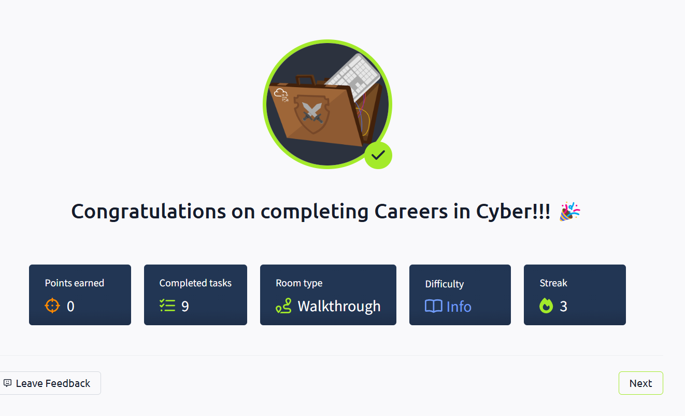

# 🚀 Pre Security Learning Log

Welcome to my cybersecurity learning portfolio!  
This repository documents my journey through the TryHackMe Pre Security Path, with hands-on labs, study notes, and reflections.

## 📚 Completed Rooms

- [x] Offensive Security Intro ✅
- [x] Defensive Security Intro ✅
- [x] Careers in Cyber ✅

## 📝 Resources

- Notes: [careers-in-cyber-notes.md](./careers-in-cyber-notes.md)
- Screenshot: 
- Notes: [defensive-security-notes.md](./defensive-security-notes.md)
- Screenshot: 

## 🎯 Goal

- Build a cybersecurity portfolio for an international career.
- Document each learning step with clear notes and evidence.
- Gain hands-on experience through TryHackMe.

## 🌍 Connect

I am preparing for a cybersecurity role abroad and documenting my learning journey openly.  
Stay tuned as this repository grows!

